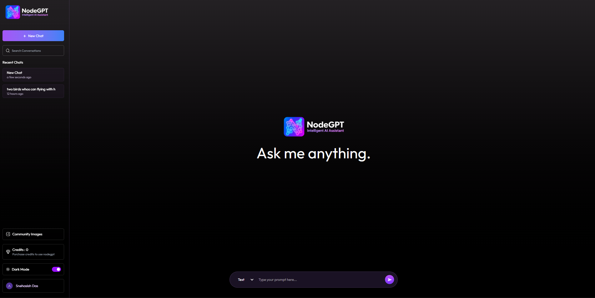

# NodeGPT — Your Personal AI Companion 🤖✨

Welcome to **NodeGPT** — an intelligent full-stack AI assistant built with the **MERN stack**.

With NodeGPT, users can **chat with AI, generate creative text, create AI-generated images, manage conversations, and purchase credits** — all through one modern and responsive application.

⚡ Powered by **Google Gemini**, NodeGPT provides AI-powered text conversations.
🎨 Integrated with **ImageKit** for handling generated AI images.
💳 Integrated with **Stripe** for secure credit purchases.
🍃 Built with **MongoDB** for reliable data management.

<h1 align="center">
  <a href="https://node-gpt-seven.vercel.app/"><strong>➥ Live Demo</strong></a>
</h1>


## 📸 Preview



---

## 💻 Tech Stack

### 🎨 Frontend

<p align="center">
  
  
  
  
  
</p>

### ⚙️ Backend

<p align="center">
  
  
  
  
  
</p>

### 🤖 AI & External Services

<p align="center">
  
  
  
</p>

---

## ✨ Features

* 👤 **User Authentication**
* 💬 **AI-powered text conversations** using Google Gemini
* 🎨 **AI Image Generation**
* 🗂️ **Chat & Conversation Management**
* 💳 **Stripe Credit Purchase System**
* 📊 **Credit-based AI Usage**
* 🖼️ **ImageKit Integration** for generated images
* 🌍 **Community Image Sharing**
* 🌙 **Dark Mode**
* 📱 **Responsive Modern UI**
* 🔀 **Separate Text & Image Generation Modes**
* 🍃 **MongoDB Database**

---

## 📂 Project Structure

```text
NodeGPT/
│
├── client/
│   ├── src/
│   ├── public/
│   └── package.json
│
├── server/
│   ├── configs/
│   ├── controllers/
│   ├── models/
│   ├── routes/
│   ├── middleware/
│   ├── server.js
│   └── package.json
│
├── .gitignore
├── homepage.png
└── README.md
```

---

## ⚡ Getting Started

```bash
# 1. Clone the repository
git clone YOUR_GITHUB_REPOSITORY_URL

# 2. Navigate to the project
cd NodeGPT

# 3. Install frontend dependencies
cd client
npm install

# 4. Install backend dependencies
cd ../server
npm install

# 5. Start the backend server
npm run dev

# 6. Start the frontend development server
cd ../client
npm run dev
```

---

## 👨‍💻 Developer

**Snehasish Das**

⭐ If you like this project, consider giving it a star!
